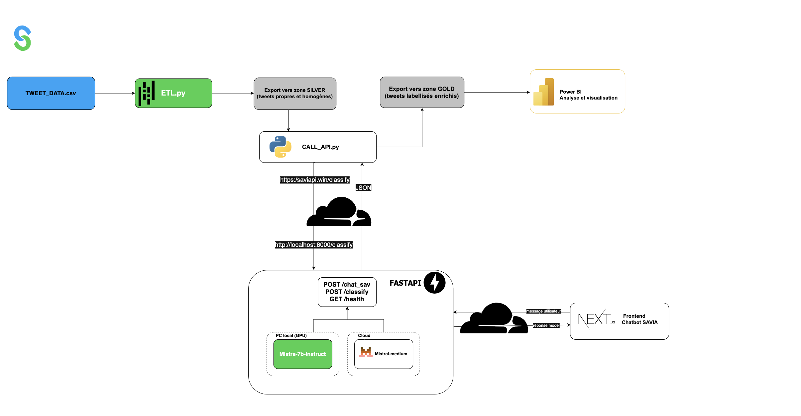
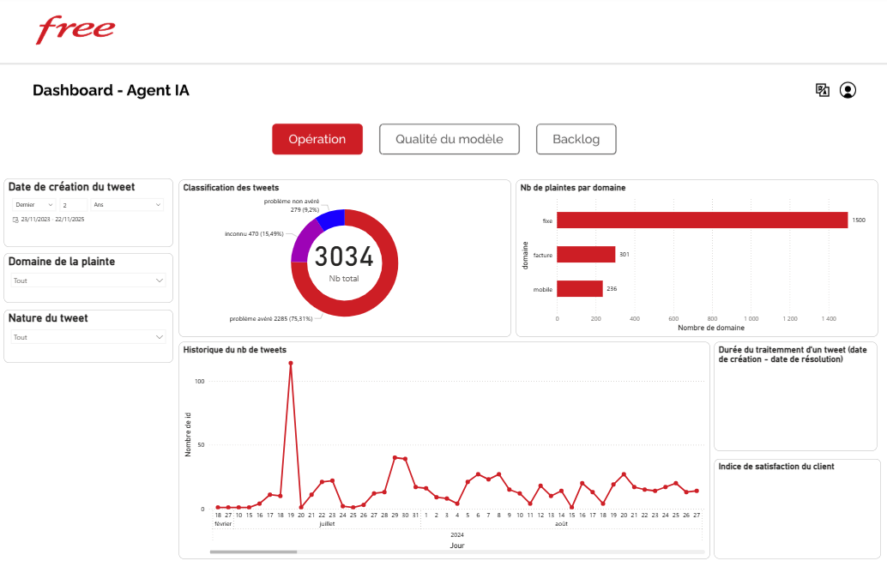
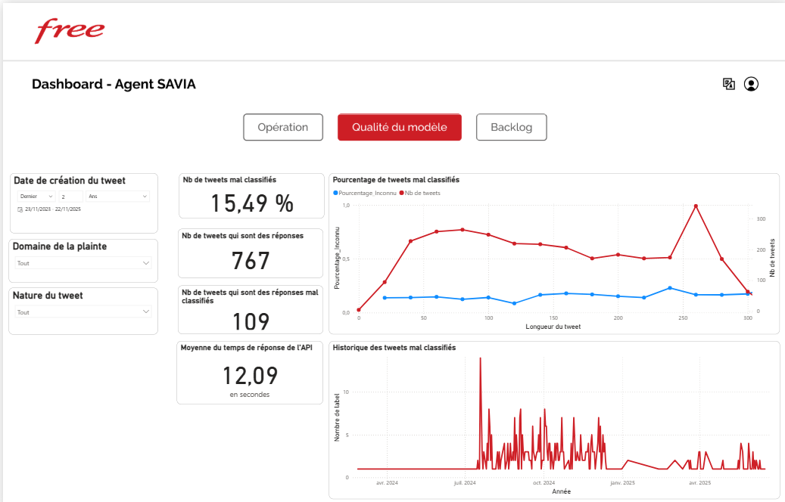

# SAVIA — Solution Digitale SAV via Tweets, LLM et Pipeline d’Enrichissement

**SAVIA** est une solution modulaire de support client (SAV) reposant sur l’analyse de tweets, un pipeline de traitement et d’enrichissement des données textuelles, et un chatbot connecté à des modèles de langage locaux ou distants.  
L’objectif est d’améliorer la qualité du service client en automatisant la détection, la compréhension et la réponse aux messages utilisateurs.

---

## 1. Fonctionnalités

SAVIA combine plusieurs briques techniques permettant de couvrir l’ensemble du cycle de traitement de la donnée textuelle :

- Ingestion et nettoyage des tweets ou messages utilisateurs  
- Transformation et normalisation des textes (suppression des mentions, hashtags, accents, URLs, etc.)  
- Export des données nettoyées vers des couches **Raw → Silver → Gold**  
- Classification et enrichissement sémantique via **LLM Mistral 7B local** ou **Mistral Medium API**  
- Stockage des résultats pour analyses Power BI  
- Interface utilisateur moderne pour interaction et visualisation  

---

## 2. Architecture technique

### Pipeline de traitement


### Frontend — `SAVIA`
Interface utilisateur développée en **Next.js**.  
Elle permet d’interagir avec le chatbot et de consulter les données enrichies.  
Les appels sont envoyés vers le backend FastAPI via les endpoints `/chat_sav` et `/classify`.

### Backend — [`SAVIA-API-LLM`](https://github.com/el-cer/SAVIA-API-LLM)
Backend principal développé avec **FastAPI**.  
Il orchestre le pipeline de traitement et les interactions avec les modèles de langage.

Endpoints disponibles :  
- `/classify` → classification sémantique et catégorisation des tweets  
- `/chat_sav` → génération de réponse via LLM  

Deux modes de modèles sont pris en charge :  
- **Local** : Mistral 7B via `llama.cpp` (modèle exécuté sur machine locale)  
- **Cloud** : Mistral Medium API (appel distant pour une meilleure précision)

### Pipeline de traitement
Implémenté en **Python**, il repose sur les bibliothèques `pandas`, `re`.  
Il est structuré selon une approche ETL classique :

1. **Cleaning** — Suppression des mentions, hashtags, URLs, emojis et caractères spéciaux  
2. **Transformation** — Normalisation, filtrage des comptes officiels, ajout de métadonnées  
3. **Load** — Export vers la couche Silver (`tweets_cleaned.csv`) ou Gold pour analyse  
4. **Classification et enrichissement LLM** — Ajout de labels, résumés et scores de similarité

Les données sont stockées sous format **CSV ou PostgreSQL**, selon l’environnement d’exécution.

### Visualisation et analyse
Les résultats Silver/Gold sont intégrés dans **Power BI** afin de suivre :

- la qualité des données (taux de nulls, longueur moyenne des messages)  
- la répartition des classes détectées  
- la performance et la cohérence des réponses LLM  

---

## 3. Technologies utilisées

- **Frontend** : Next.js  
- **Backend** : FastAPI  
- **LLM** : Mistral 7B local (llama.cpp) et Mistral Medium API  
- **Traitement de données** : Python, pandas, regex, nltk, spacy  
- **Stockage** : CSV / PostgreSQL  
- **Visualisation** : Power BI  
- **Conteneurisation** : Docker, exécution locale ou cloud  

---

## 4. Structure simplifiée

```plaintext
SAVIA/
├── frontend/                     # Interface Next.js
├── backend/                      # FastAPI BFF (voir SAVIA-API-LLM)
├── data/
│   ├── raw/                      # Données brutes (tweets)
│   ├── silver/                   # Données nettoyées
│   └── gold/                     # Données enrichies
├── quality/                      # Logs et rapports de qualité
├── images/                       # Diagrammes et schémas d'architecture
└── README.md ```

---
## 5. Lancer le frontend Next.js (interface utilisateur)

###  Prérequis
- **Node.js ≥ 18**
- **npm** ou **yarn**
- Backend FastAPI actif sur :
  - `http://localhost:8000` (local)
  - ou `https://savia-api.elcer.dev` (Cloudflare Tunnel)

---

### Étapes d’installation et exécution directe


```bash
#  Aller dans le dossier frontend
cd SAVIA/frontend
docker build -t savia-frontend .
docker run -p 3000:3000 savia-frontend
```
## 5. Dashboard
Voici la première page du dashboard.
 


Et la deuxième.




