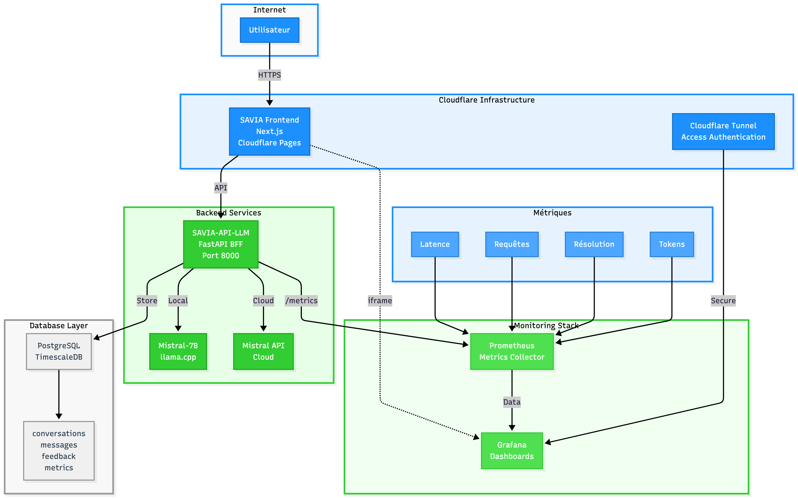

# SAVIA — Solution Digitale SAV via Tweets + LLM + Chatbot

SAVIA est une solution modulaire de support client (SAV) qui :
- Est un chatbot permettant au clients de dire le problème qu'il a par la suite le bot répondra et  
---

##  Architecture



- `data/` : tweets CSV, nettoyage, classification ML
- `backend/` : API Flask/FastAPI qui détecte les plaintes et appelle le LLM
- `frontend/` : interface utilisateur (Next.js)
- `docker/` : conteneurisation front + back

---

##  Lancement local

```bash
git clone git@github.com:el-cer/SAVIA.git
cd SAVIA
docker-compose up --build
